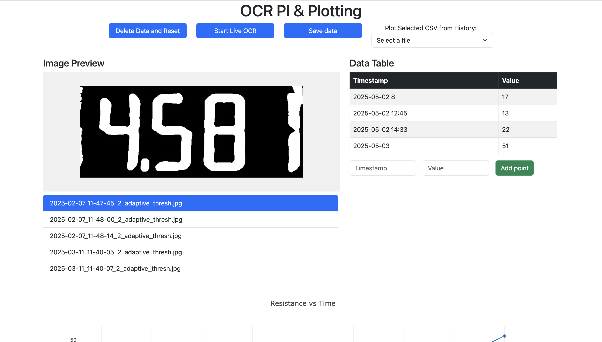
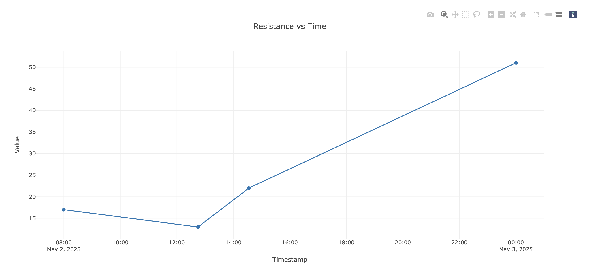
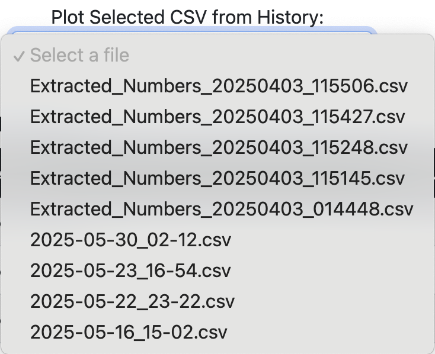

### OCR-Web-Graph
This is a flask project based on raspberry PI and its camera module, which aiming to detect seven segment digits on multimeter. It also allow automatic graphing through website.
This project is based on Raspberry Pi and camera module design, so the webpage consists of multiple areas to complete the interaction between user-camera-multimeter. The webpage contains an image preview area, a table input area and a chart display area below. *(Powered by plotly.js)*

# Preview

## Graph support

## Interactive button

*Save Data* Save exist //
data on the data table as csv file

*Delete data and Reset* //
Delete the data points in the plotly.js, so the user can regraph 

*Start Live OCR* //
Start Binding script on the raspberry Pi, if available

## Load history file
 //

Selecting past csv file to plot the graph and refill the sheet.

